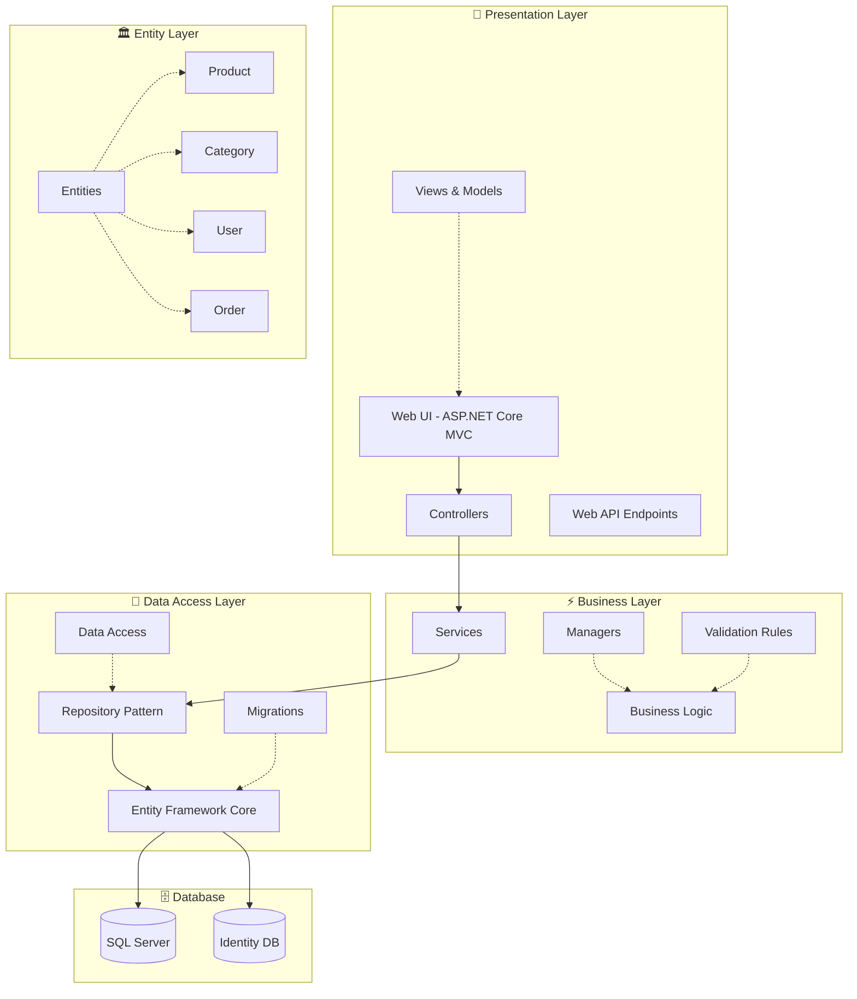
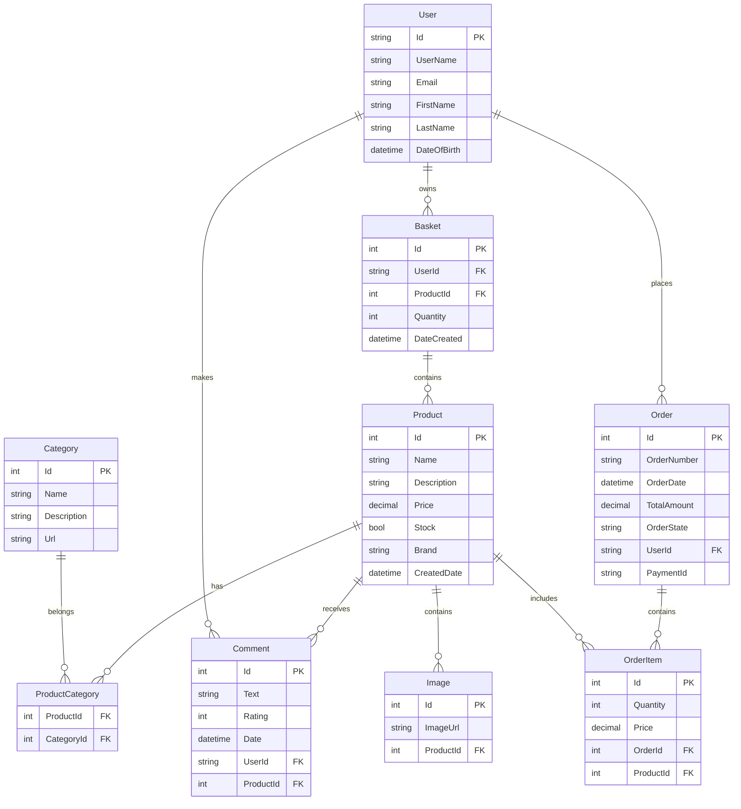

# 🛍️ PRODORA - Modern E-Ticaret Platformu

<div align="center">


**🚀 Next Generation E-Commerce Platform with Advanced Features**

[](https://dotnet.microsoft.com/)
[](https://docs.microsoft.com/en-us/dotnet/csharp/)
[](https://docs.microsoft.com/en-us/ef/)
[](https://www.microsoft.com/en-us/sql-server)
[](https://getbootstrap.com/)


</div>

---

## 📸 Ekran Görüntüleri

<div align="center">

### 🏠 Ana Sayfa


### 🛒 Ürün Detay & Sepet


### 👨‍💼 Admin Panel & Kullanıcı Hesabı


### 💳 Ödeme Sistemi


</div>

---

## 🎯 Proje Özeti

**Prodora**, modern e-ticaret ihtiyaçlarına yönelik geliştirilmiş, tam özellikli bir online alışveriş platformudur. Katmanlı mimari (N-Tier Architecture) kullanılarak geliştirilmiş, güvenli ve ölçeklenebilir bir yapıya sahiptir.

---

## 🏗️ Mimari Yapı

<div align="center">



</div>

---

## 💻 Teknoloji Stack'i

<div align="center">

### �️ Backend Teknolojileri

| Teknoloji | Versiyon | Kullanım Alanı | Açıklama |
|-----------|----------|----------------|-----------|
|  | **6.0** | 🏗️ **Core Framework** | Ana uygulama framework'ü |
|  | **11.0** | 💻 **Programming Language** | Ana programlama dili |
|  | **6.0** | 🌐 **Web Framework** | MVC pattern, Web API |
|  | **6.0** | 🗄️ **ORM** | Code-First, Migration, LINQ |
|  | **2019+** | 💾 **Database** | İlişkisel veritabanı |
|  | **6.0** | 🔐 **Authentication** | Kullanıcı yönetimi ve güvenlik |

### 🎨 Frontend Teknolojileri

| Teknoloji | Versiyon | Kullanım Alanı | Açıklama |
|-----------|----------|----------------|-----------|
|  | **5** | 📝 **Markup** | Semantic HTML yapısı |
|  | **3** | 🎨 **Styling** | Modern CSS, Flexbox, Grid |
|  | **ES6+** | ⚡ **Scripting** | DOM manipulation, AJAX |
|  | **5.2** | 📱 **UI Framework** | Responsive design, Components |
|  | **3.6** | 🔧 **Library** | DOM operations, AJAX calls |
|  | **6.0** | 🎭 **Icons** | Modern icon library |

### 🔧 Geliştirme Araçları

| Araç | Kullanım Alanı | Açıklama |
|------|----------------|-----------|
|  | 🛠️ **IDE** | Ana geliştirme ortamı |
|  | 🗄️ **Database Tool** | Veritabanı yönetimi |
|  | 📝 **Version Control** | Kaynak kod yönetimi |
|  | 📦 **Package Manager** | .NET paket yönetimi |

</div>

---

## 🚀 Özellikler

<div align="center">

### 👥 Kullanıcı Özellikleri

</div>

| Özellik | Durum | Açıklama |
|---------|-------|----------|
| 🔐 **Kullanıcı Kayıt/Giriş** | ✅ | E-posta doğrulamalı hesap oluşturma |
| 🛍️ **Ürün Görüntüleme** | ✅ | Kategorilere göre filtreleme ve arama |
| 🛒 **Sepet İşlemleri** | ✅ | Ürün ekleme, çıkarma, güncelleme |
| 💳 **Ödeme Sistemi** | ✅ | Iyzico entegrasyonu ile güvenli ödeme |
| 📝 **Yorum & Değerlendirme** | ✅ | Ürünlere yorum yapma ve puanlama |
| 📧 **E-posta Bildirimleri** | ✅ | Hesap doğrulama ve sipariş bildirimleri |
| 📱 **Responsive Tasarım** | ✅ | Mobil uyumlu modern arayüz |
| 🔍 **Gelişmiş Arama** | ✅ | Fiyat aralığı ve kategori filtreleri |

<div align="center">

### 👨‍💼 Admin Özellikleri

</div>

| Özellik | Durum | Açıklama |
|---------|-------|----------|
| 📊 **Dashboard** | ✅ | Satış istatistikleri ve genel bakış |
| 🏷️ **Ürün Yönetimi** | ✅ | CRUD işlemleri, resim yükleme |
| 📂 **Kategori Yönetimi** | ✅ | Kategori ekleme, düzenleme, silme |
| 👥 **Kullanıcı Yönetimi** | ✅ | Rol bazlı yetki kontrolü |
| 📋 **Sipariş Takibi** | ✅ | Sipariş durumu güncelleme |
| 💬 **Yorum Moderasyonu** | ✅ | Yorumları onaylama/reddetme |
| 📈 **Raporlama** | ✅ | Satış ve kullanıcı raporları |
| 🔧 **Sistem Ayarları** | ✅ | Genel sistem konfigürasyonu |

---

## 📁 Proje Yapısı

<div align="center">

```
📦 Prodora Solution
├── 🏛️ Prodora.Entitys                 # Entity Layer
│   ├── 📄 Product.cs                  # Ürün entity'si
│   ├── 📄 Category.cs                 # Kategori entity'si
│   ├── 📄 Order.cs                    # Sipariş entity'si
│   ├── 📄 Comment.cs                  # Yorum entity'si
│   ├── 📄 Basket.cs                   # Sepet entity'si
│   └── 📄 Image.cs                    # Resim entity'si
├── 💾 Prodora.DataAccess              # Data Access Layer
│   ├── 📁 Abstract/                   # Interface'ler
│   │   ├── 📄 IRepository.cs          # Generic repository
│   │   ├── 📄 IProductDal.cs          # Ürün data access
│   │   ├── 📄 ICategoryDal.cs         # Kategori data access
│   │   └── 📄 ...                     # Diğer DAL interface'leri
│   ├── 📁 Concrate/EfCore/            # EF Core implementasyonları
│   │   ├── 📄 DataContext.cs          # DbContext
│   │   ├── 📄 EfCoreProductDal.cs     # Ürün EF implementasyonu
│   │   ├── 📄 EfCoreCategoryDal.cs    # Kategori EF implementasyonu
│   │   └── 📄 ...                     # Diğer EF implementasyonları
│   └── 📁 Migrations/                 # EF Core migration'ları
├── ⚡ Prodora.Business                # Business Layer
│   ├── 📁 Abstract/                   # Service interface'leri
│   │   ├── 📄 IProductServices.cs     # Ürün service interface
│   │   ├── 📄 ICategoryServices.cs    # Kategori service interface
│   │   └── 📄 ...                     # Diğer service interface'leri
│   └── 📁 Concrate/                   # Service implementasyonları
│       ├── 📄 ProductManager.cs       # Ürün business logic
│       ├── 📄 CategoryManager.cs      # Kategori business logic
│       └── 📄 ...                     # Diğer manager sınıfları
└── 🌐 Prodora.WebUI                   # Presentation Layer
    ├── 📁 Controllers/                # MVC Controller'lar
    │   ├── 📄 HomeController.cs       # Ana sayfa
    │   ├── 📄 ShopController.cs       # Mağaza işlemleri
    │   ├── 📄 AccountController.cs    # Hesap işlemleri
    │   ├── 📄 AdminController.cs      # Admin panel
    │   └── 📄 BasketController.cs     # Sepet işlemleri
    ├── 📁 Views/                      # Razor View'lar
    │   ├── 📁 Home/                   # Ana sayfa view'ları
    │   ├── 📁 Shop/                   # Mağaza view'ları
    │   ├── 📁 Account/                # Hesap view'ları
    │   ├── 📁 Admin/                  # Admin view'ları
    │   └── 📁 Shared/                 # Paylaşılan view'lar
    ├── 📁 Models/                     # ViewModel'ler
    ├── 📁 wwwroot/                    # Static dosyalar
    │   ├── 📁 css/                    # CSS dosyaları
    │   ├── 📁 js/                     # JavaScript dosyaları
    │   ├── 📁 img/                    # Resim dosyaları
    │   └── 📁 Prodora-İmage/          # Proje ekran görüntüleri
    ├── 📁 Identity/                   # ASP.NET Identity
    ├── 📁 Extensions/                 # Extension method'lar
    ├── 📁 Middlewares/               # Custom middleware'ler
    └── 📄 Program.cs                  # Uygulama başlangıç noktası
```

</div>

---

## 🎯 Design Patterns & Architectures

<div align="center">

| Pattern/Architecture | Kullanım Alanı | Açıklama |
|---------------------|----------------|-----------|
| 🏗️ **N-Tier Architecture** | Genel mimari | Katmanlı mimari yapısı |
| 📦 **Repository Pattern** | Data Access | Veri erişim soyutlaması |
| 🔧 **Dependency Injection** | IoC Container | Bağımlılık enjeksiyonu |
| 🎭 **MVC Pattern** | Web Layer | Model-View-Controller |
| 🏭 **Manager Pattern** | Business Layer | İş mantığı yönetimi |
| 🔍 **Generic Repository** | Data Access | Tip güvenli veri işlemleri |
| 🛡️ **Unit of Work** | Data Access | Transaction yönetimi |

</div>

---

## 🗄️ Veritabanı Şeması

<div align="center">



</div>

---

## � Kurulum ve Çalıştırma

### 📋 Gereksinimler

-  **.NET 6.0 SDK** veya üzeri
-  **SQL Server 2019+** veya **SQL Server Express**
-  **Visual Studio 2022** (önerilen)

### 🚀 Adım Adım Kurulum

#### 1️⃣ **Projeyi Klonlayın**
```bash
git clone https://github.com/egegeegege/Prodora.git
cd Prodora
```

#### 2️⃣ **Veritabanı Bağlantı Stringlerini Ayarlayın**
```json
// appsettings.json
{
  "ConnectionStrings": {
    "DefaultConnection": "Server=.;Database=ProdoraDb;Trusted_Connection=true;TrustServerCertificate=true",
    "IdentityConnection": "Server=.;Database=ProdoraIdentityDb;Trusted_Connection=true;TrustServerCertificate=true"
  }
}
```

#### 3️⃣ **NuGet Paketlerini Yükleyin**
```bash
dotnet restore
```

#### 4️⃣ **Veritabanını Oluşturun**
```bash
# Ana veritabanı migration'ı
dotnet ef database update --project Prodora.DataAccess --startup-project Prodora.WebUI

# Identity veritabanı migration'ı  
dotnet ef database update --context ApplicationIdentityDbContext --project Prodora.WebUI
```

#### 5️⃣ **Projeyi Çalıştırın**
```bash
dotnet run --project Prodora.WebUI
```

#### 6️⃣ **Tarayıcıda Açın**
```
https://localhost:5001
```

---

## 🔐 Güvenlik Özellikleri

<div align="center">

| Güvenlik Özelliği | Durum | Açıklama |
|-------------------|-------|----------|
| 🔒 **HTTPS Enforcement** | ✅ | Tüm iletişim şifreli |
| 🛡️ **CSRF Protection** | ✅ | Cross-site request forgery koruması |
| 🔑 **JWT Token** | ✅ | Güvenli authentication token'ları |
| 📧 **Email Verification** | ✅ | E-posta doğrulaması zorunlu |
| 🔐 **Password Policy** | ✅ | Güçlü şifre kuralları |
| 🚫 **XSS Protection** | ✅ | Cross-site scripting koruması |
| 🔒 **SQL Injection Protection** | ✅ | Parametrized query'ler |
| 👥 **Role-Based Access** | ✅ | Rol tabanlı yetki kontrolü |

</div>

---

## 📊 Performans Özellikleri

<div align="center">

| Özellik | Değer | Açıklama |
|---------|-------|----------|
| ⚡ **Sayfa Yükleme Süresi** | `< 2s` | Optimize edilmiş kaynak yükleme |
| 🗄️ **Veritabanı Sorgu Optimizasyonu** | ✅ | LINQ & EF Core optimizasyonları |
| 📱 **Responsive Design** | ✅ | Tüm cihazlarda uyumlu |
| 🎨 **CSS/JS Minification** | ✅ | Sıkıştırılmış static dosyalar |
| 🖼️ **Image Optimization** | ✅ | Optimize edilmiş resim boyutları |
| 💾 **Caching Strategy** | ✅ | Memory ve output caching |

</div>

---

## 🧪 Test Stratejisi

<div align="center">

| Test Türü | Durum | Araç/Framework |
|-----------|-------|----------------|
| 🧩 **Unit Tests** | 🔄 | xUnit, Moq |
| 🔗 **Integration Tests** | 🔄 | ASP.NET Core Test Host |
| 🌐 **End-to-End Tests** | 📋 | Selenium WebDriver |
| 📊 **Performance Tests** | 📋 | NBomber, BenchmarkDotNet |
| 🔒 **Security Tests** | 📋 | OWASP ZAP |

</div>

**Durum Açıklaması:**
- ✅ Tamamlandı
- 🔄 Devam ediyor
- 📋 Planlandı

---

## 📈 Gelecek Planları

<div align="center">

### 🚀 Yakın Gelecek (Q1 2025)

</div>

| Özellik | Öncelik | Açıklama |
|---------|---------|----------|
| 📱 **Mobile App** | 🔥 **Yüksek** | React Native ile mobil uygulama |
| 🌐 **Multi-Language** | 🔥 **Yüksek** | Çoklu dil desteği |
| 📊 **Advanced Analytics** | 📊 **Orta** | Gelişmiş satış analitiği |
| 🔔 **Push Notifications** | 📊 **Orta** | Gerçek zamanlı bildirimler |
| 🎁 **Loyalty Program** | 📊 **Orta** | Müşteri sadakat programı |

<div align="center">

### 🔮 Uzun Vadeli (2025-2026)

</div>

| Özellik | Açıklama |
|---------|----------|
| 🤖 **AI Recommendations** | Yapay zeka destekli ürün önerileri |
| 🛒 **Multi-Vendor Support** | Çok satıcılı marketplace |
| 📦 **Advanced Inventory** | Gelişmiş stok yönetimi |
| 💬 **Live Chat Support** | Canlı müşteri desteği |
| 🌍 **Global Shipping** | Uluslararası kargo entegrasyonu |

---

## 🤝 Katkıda Bulunma

Projeye katkıda bulunmak istiyorsanız:

1. 🍴 **Fork** edin
2. 🌿 **Feature branch** oluşturun (`git checkout -b feature/AmazingFeature`)
3. 💾 **Commit** edin (`git commit -m 'Add some AmazingFeature'`)
4. 📤 **Push** edin (`git push origin feature/AmazingFeature`)
5. 🔄 **Pull Request** açın

---

## 📄 Lisans

Bu proje **MIT Lisansı** ile lisanslanmıştır. Detaylar için [LICENSE](LICENSE) dosyasına bakınız.

---

## 📞 İletişim & Destek

<div align="center">

[](https://github.com/egegeegege)
[](mailto:prodora@example.com)
[](https://linkedin.com/in/yourprofile)

**💬 Discord:** [Prodora Community Server](https://discord.gg/prodora)  
**📧 Email:** prodora@example.com  
**🐛 Issues:** [GitHub Issues](https://github.com/egegeegege/Prodora/issues)

</div>

---

<div align="center">

### 🌟 Bu projeyi beğendiyseniz star vermeyi unutmayın!

**Made with ❤️ by [Ege Developer](https://github.com/egegeegege)**


---

*© 2025 Prodora. Tüm hakları saklıdır.*

</div>

3. **Veritabanını Oluşturun:**
   ```sh
   dotnet ef database update --project Prodora.DataAccess
   ```

4. **Projeyi Çalıştırın:**
   ```sh
   dotnet run --project Prodora.WebUI
   ```

---

## 👤 Kullanıcı Rolleri

- **Admin:** Ürün ve kategori yönetimi, kullanıcı yönetimi, sistem ayarları.
- **Kullanıcı:** Ürünleri görüntüleme, sepete ekleme, sipariş verme, profil yönetimi.

---

## 📸 Ekran Görüntüleri

> Modern ve şık arayüz, kolay yönetim paneli ve kullanıcı dostu alışveriş deneyimini Deneyinleyin!


---

## 📄 Lisans

Bu proje [MIT Lisansı](https://opensource.org/licenses/MIT) ile lisanslanmıştır.

---

## 💡 Katkıda Bulunmak

Katkılarınızı memnuniyetle karşılıyoruz! Lütfen önce bir [issue](https://github.com/egeaydn/prodora/issues) açın ve ardından bir pull request gönderin.

---

## 📬 İletişim

Her türlü soru ve öneriniz için:  
**E-posta:** egeaydinn31@gmail.com 
**LinkedIn:** [linkedin.com/company/prodora]([https://linkedin.com/company/prodora](https://www.linkedin.com/in/ege-ayd%C4%B1n-156704317/))

---

> **Prodora** – Güçlü, modern ve güvenli e-ticaret yönetimi.
