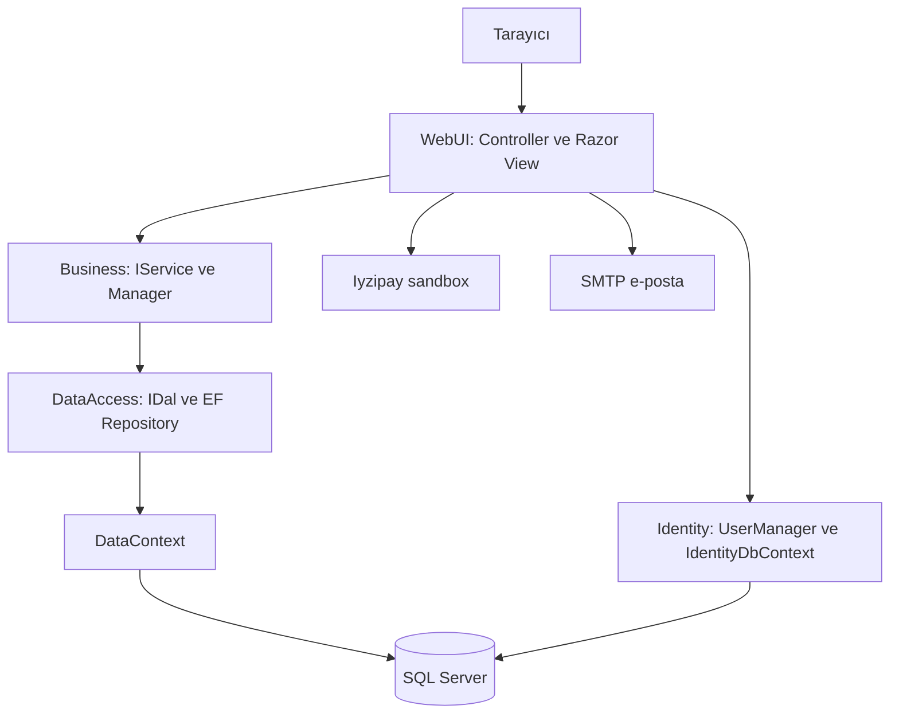

# Prodora proje incelemesi

İnceleme tarihi: 25 Eylül 2026. İncelenen yerel commit: `b30b9e2` — 14 Kasım 2025.

> Bu belge ilk incelemenin tarihsel kaydıdır. 26 Eylül 2026 tarihinde uygulanan düzeltmeler ve güncel test/migration bilgileri için [güvenilirlik notlarına](GUVENILIRLIK_DUZELTMELERI.md) bak.

**Genel değerlendirme**

Hatırlanan mimarinin adı **N-tier architecture / katmanlı mimari**. Prodora; ASP.NET Core MVC, Entity Framework Core, SQL Server ve ASP.NET Core Identity kullanan, dört projeye ayrılmış bir e-ticaret uygulaması. Mevcut dağıtım yapısı açısından tek WebUI uygulaması içinde çalışan **katmanlı monolit** olarak tanımlanabilir. Dört proje dört ayrı sunucu veya servis anlamına gelmiyor.

Katman sınırları ve interface kullanımı mevcut. Ancak Business katmanı çoğunlukla DAL çağrılarını aktarıyor; ödeme, sipariş oluşturma ve hesap işlemlerinin önemli bölümü WebUI controller'larında. Yapı, klasik katmanlı mimariyi takip ediyor; bağımlılıkların merkeze yöneldiği bir Clean/Onion Architecture uygulaması değil.

Proje, ana alışveriş akışını kurmuş bir geliştirme prototipi olarak değerlendirilebilir. Yetkilendirme, veri bütünlüğü ve ödeme sorunları nedeniyle mevcut haliyle gerçek müşterilere açılmaya hazır olduğu söylenemez. Bu değerlendirme aşağıdaki somut kod bulgularına dayanıyor.

**Kapsam ve doğrulama**

- Dört proje dosyası, yedi controller, beş manager, repository'ler, entity'ler, Identity, middleware, migration yapısı, temel Razor ekranları, ilgili JavaScript dosyaları ve CI yapılandırması incelendi.
- Git tarafından takip edilen 86 C# dosyasının 64'ü migration dışında. Bu 64 dosya toplam 4.013 satır içeriyor; yorumlar ve boş satırlar dahil. Ayrıca 37 Razor view var.
- `dotnet build Prodora.sln --no-restore --nologo -v quiet` çalıştırıldı: **0 hata, 158 uyarı**. Derleme mevcut yerel restore çıktılarıyla, SDK 10.0.400 kullanılarak yapıldı; projeler `net8.0` hedefliyor.
- Test projesi bulunmadı. GitHub Actions içinde `dotnet test` komutu olması, iş kurallarının test edildiğini göstermiyor.
- Uygulama başlatılmadı; veritabanı sorgusu, migration uygulama, yedek geri yükleme, e-posta gönderme veya ödeme isteği yapılmadı. Çalışma zamanı etkileri aşağıda kod akışından çıkarım olarak anlatılıyor.
- Uygulama kodunda değişiklik yapılmadı. Yalnızca bu inceleme raporu eklendi. Gizli değerler rapora alınmadı.

**Katmanlar ve bağımlılıklar**

1. **Prodora.Entitys:** Ürün, kategori, resim, yorum, sepet ve sipariş veri modelleri. Diğer proje katmanlarına bağımlı değil. Entity'lerde bazı DataAnnotations ve tablo eşlemeleri var.
2. **Prodora.DataAccess:** `IRepository<T>`, entity'ye özel DAL interface'leri, EF Core repository implementasyonları, `DataContext` ve ticaret verilerinin migration'ları. Entitys projesine bağımlı.
3. **Prodora.Business:** `IProductServices`, `IBasketServices` gibi servis sözleşmeleri ve `ProductManager`, `BasketManager` gibi implementasyonlar. DataAccess ve Entitys projelerine bağımlı.
4. **Prodora.WebUI:** Controller, Razor View, ViewModel, Identity, e-posta, routing, middleware ve statik dosyalar. Proje referansı Business'a; DataAccess ve Entitys'e dolaylı erişimi de kullanıyor. `Program.cs` DI kayıtlarını bir araya getiriyor.

Şemadaki oklar çalışma sırasındaki başlıca çağrıları gösterir. Entitys, bir istek aşaması değil; katmanların paylaştığı model projesidir. Business'ın DAL sözleşmesine constructor üzerinden erişmesi olumlu; ancak sözleşme ve EF implementasyonunun aynı DataAccess projesinde olması Business'ın bu projeye derleme bağımlılığını koruyor.

`ApplicationIdentityDbContext` WebUI içinde ve DI ile yapılandırılmış. `DataContext` DataAccess içinde; repository'ler her metotta `new DataContext()` oluşturuyor. Mevcut iki bağlantı yapılandırmasında veritabanı adı `Prodora`; bağlantı/kimlik doğrulama ayarları farklı. İki context bulunması tek başına iki ayrı fiziksel veritabanı olduğu anlamına gelmiyor. Gerçek veritabanı durumu incelenmedi.

Kaynaklar: [DI kayıtları](../Prodora.WebUI/Program.cs), [generic repository](../Prodora.DataAccess/Concrate/EfCore/EfCoreGenericRepository.cs), [ProductManager](../Prodora.Business/Concrate/ProductManager.cs).

**Açık olan ShopController nasıl çalışıyor?**

`List(category, page)` için akış şöyle:

1. `/products/{category?}` isteği alınır; sayfa büyüklüğü 6'dır.
2. Kategori küçük harfe çevrilir.
3. Toplam ürün sayısı ve o sayfanın ürünleri Business üzerinden ayrı ayrı istenir.
4. `ProductManager`, çağrıları `IProductDal` üzerinden EF implementasyonuna aktarır.
5. `EfCoreProductDal`, kategoriyi filtreler ve `Skip/Take` uygular.
6. `ProductListModel`, Razor view'a verilir. Kategori listesi ViewComponent ile; sayfa bağlantıları özel TagHelper ile oluşturulur.

`Details(id)` ürün, görseller ve kategorileri alır; aynı kategoriden benzer ürünler seçer; yorumları getirir ve yorum yazan kişileri Identity'den bulur. Silinmiş kullanıcıların yorumlarını görüntüleme listesinden çıkarır. Buradaki “aktif kullanıcı” ifadesi gerçekte sadece kullanıcının hâlâ bulunabilmesi anlamındadır; kilitli/onaylı hesap kontrolü yapılmıyor.

Kaynak: [ShopController](../Prodora.WebUI/Controllers/ShopController.cs), özellikle satır 23, 46 ve 68.

**Veri modeli ve ana kullanıcı akışı**

- `Product ↔ Category`: `ProductCategory` ara tablosuyla çoktan çoğa. Birleşik anahtar `ProductId + CategoryId`.
- `Product → Image` ve `Product → Comment`: bire çok.
- `Basket → BasketItem → Product`: kullanıcı sepetinin satırları.
- `Order → OrderItem → Product`: sipariş ve satın alma satırları. `OrderItem.Price` satın alma anındaki fiyatı saklayabiliyor.
- Kullanıcı, Identity tarafında `ApplicationUser`. Ticaret entity'lerinde kullanıcıya `string UserId` ile referans veriliyor; `DataContext` içinde Identity kullanıcısına ilişkisel yabancı anahtar tanımı yok.
- `Product.Stock` sayısal stok miktarı değil, `bool`. Stok var/yok bilgisini tutuyor.

Kayıt sırasında Identity kullanıcısı oluşturuluyor ve onay e-postası hazırlanıyor. E-posta onayı başarılı olduğunda kullanıcı sepeti açılıyor. Girişten sonra ürün sepete ekleniyor; checkout sırasında sepet ve fiyatlar veritabanından yeniden okunuyor. Kredi kartı seçilirse Iyzipay sandbox çağrılıyor, EFT seçilirse doğrudan sipariş kaydı oluşturuluyor. Ardından sepet temizleniyor.

Checkout'un normal akışta fiyatları sunucudan yeniden okuması olumlu. Bununla birlikte aşağıdaki public yardımcı metotlar ve eksik kontroller bu akışın zorunlu olarak izlenmesini engelliyor.

**En önce ele alınması gereken bulgular**

1. **Admin endpoint'lerinde yetki kontrolü bulunmuyor.** `AdminController` satır 13 ve işlem metotlarında `[Authorize(Roles = "admin")]` yok; `Program.cs` içinde bunu karşılayan global/fallback politika da yok. Menüdeki `IsInRole` kontrolleri yalnızca görünümü değiştiriyor. Kod düzeyinde ürün/kategori oluşturma, değiştirme, silme ve dosya yükleme giriş yapmamış kullanıcıya karşı korunmuyor. [AdminController](../Prodora.WebUI/Controllers/AdminController.cs)

2. **Anonim sipariş isteği tüm siparişleri seçebiliyor.** `BasketController.GetOrders` satır 370, kullanıcı ID'sini kontrol etmeden servise gönderiyor. `EfCoreOrderDal.GetOrders` satır 29 ise ID boşsa kullanıcı filtresini uygulamıyor. Sonuç, tüm siparişleri seçen sorgu oluyor. View; müşteri adı, adres, telefon ve e-posta gösteriyor. Bu, yalnızca teorik bir “Authorize eksik” bulgusu değil; veriye kadar izlenebilen bir gizlilik sorunu. [Controller](../Prodora.WebUI/Controllers/BasketController.cs), [DAL](../Prodora.DataAccess/Concrate/EfCore/EfCoreOrderDal.cs), [View](../Prodora.WebUI/Views/Basket/GetOrders.cshtml)

3. **Yardımcı metotlar HTTP action olarak açılıyor.** `ClearBasket` satır 57, `PaymentProccess` satır 242 ve `SaveOrder` satır 330 public; `[NonAction]` da yok. MVC controller'larında bu tür public metotlar action kabul edilir. `ClearBasket` dışarıdan verilen sepet ID'siyle sahiplik kontrolü olmadan çalışıyor. `SaveOrder`, dışarıdan bağlanan kullanıcı/sepet modeliyle sipariş oluşturabilir ve ödeme doğrulaması yapmaz. İç operasyonlar private olmalı veya uygulama servisine taşınmalı. [BasketController](../Prodora.WebUI/Controllers/BasketController.cs). Framework davranışı: [Microsoft MVC actions belgesi](https://learn.microsoft.com/en-us/aspnet/core/mvc/controllers/actions?view=aspnetcore-2.0).

4. **Kategori güncellemesi silme işlemi yapıyor.** `AdminController.EditCategory` → `CategoryManager.Update` → `EfCoreCategoryDal.Update` zincirinin sonunda `context.Categories.Remove(entity)` var. Geçerli bir kategori düzenleme isteği kaydı güncellemek yerine silmeye çalışır. [EfCoreCategoryDal.cs, satır 53–58](../Prodora.DataAccess/Concrate/EfCore/EfCoreCategoryDal.cs)

5. **Gizli ayarlar kaynak kodunda tutuluyor.** Ticaret veritabanı bağlantısı `DataContext` satır 24'te; SMTP kimlik bilgileri `MailHelper` satır 45'te; sandbox ödeme anahtarları `BasketController` satır 248–249'da; admin başlangıç parolası `appsettings.json` içinde. Bunların halen geçerli olup olmadığı denenmedi. Ortam ayarlarına/gizli değer deposuna taşınmalı; gerçek ve paylaşılmış değerler yenilenmeli. Takip edilen `Prodora.bak` yaklaşık 12,3 MiB; içeriği incelenmedi ve kişisel veri içerip içermediği bilinmiyor.

6. **Dosya yükleme ve HTML açıklama birlikte ek risk oluşturuyor.** Ürün oluştururken `file.FileName` doğrudan `Path.Combine` ve `FileMode.Create` ile kullanılıyor. Güvenli dosya adı üretimi ve sunucu tarafında dosya türü/boyut denetimi yok. Düzenleme GUID kullanıyor ama dosya türünü yine doğrulamıyor. Ürün açıklaması detay view'ında `Html.Raw` ile yazdırılıyor; HTML temizleme bulunmadı. Korunmayan ürün yazma endpoint'leriyle birlikte bu, dosya üzerine yazma/yol geçişi ve kalıcı script çalıştırma riskidir. [AdminController, satır 80–91](../Prodora.WebUI/Controllers/AdminController.cs), [Details.cshtml, satır 46 ve 74](../Prodora.WebUI/Views/Shop/Details.cshtml)

7. **Yorum silmede kullanıcı sahipliği kontrol edilmiyor.** `CommentController.Delete` satır 109, yalnızca ID üzerinden bulup siliyor. Sahiplik kontrolü sadece Razor'da silme butonunu gizlemek için var. Ayrıca action HTTP POST ile sınırlandırılmamış. Yorum oluşturma da anonim kullanıcı için `UserId = "0"` atayabiliyor. [CommentController](../Prodora.WebUI/Controllers/CommentController.cs)

8. **Sunucu tarafı antiforgery doğrulaması eksik.** Bazı formlarda token üretiliyor; controller'larda doğrulama attribute'u veya global `AutoValidateAntiforgeryToken` kaydı bulunmadı. Token üretmek ve doğrulamak ayrı adımlar. Cookie'de `SameSite.Strict` kullanılıyor; bu, token doğrulamasının yerine geçen bir uygulama kontrolü değil. Veri değiştiren GET action'ları da POST ile sınırlandırılmalı. [Program.cs](../Prodora.WebUI/Program.cs), [Microsoft antiforgery belgesi](https://learn.microsoft.com/en-us/aspnet/core/security/anti-request-forgery?view=aspnetcore-8.0)

9. **Middleware sırası yanlış.** `UseAuthorization` satır 98, `UseRouting` satır 100'den önce. Derleyici bunu `ASP0001` ile bildiriyor. Sıra routing → authentication → authorization → endpoint yürütme olacak şekilde düzenlenmeli. Yetkilendirme attribute'ları eklenirken bu da düzeltilmeli. [Program.cs](../Prodora.WebUI/Program.cs), [Microsoft middleware belgesi](https://learn.microsoft.com/en-us/aspnet/core/fundamentals/middleware/?view=aspnetcore-8.0)

**Ödeme, sepet ve sipariş doğruluğu**

- **Kuruş kaybı:** Ödeme toplamı `InvariantCulture` ile iki ondalık basamaklı üretiliyor; ödeme kalemi fiyatı satır 318'de `ToString().Split(',')[0]` kullanıyor. Türkçe kültürde 199,90 tutarı `199` olur. Kalemler toplamı ile ödeme toplamı uyuşmayabilir. Aynı para formatlama politikası kullanılmalı.
- **EFT hemen tamamlandı sayılıyor:** `SaveOrder` her ödeme yöntemi için `OrderStatus.Completed` atıyor. EFT için ödeme bekleme durumu yok. `paymentMethod` yalnızca kredi kartı eşitliğiyle ayrılıyor; geçersiz değerler ayrıca reddedilmiyor.
- **Gerçek ödeme kimlikleri saklanmıyor:** `PaymentId`, `PaymentToken`, `ConversionId` ödeme yanıtından alınmak yerine yeni GUID değerleri oluyor. Sağlayıcıyla mutabakat ve iade takibi güçleşir.
- **Eski sipariş fiyatı değişebiliyor:** `GetOrders` satır 397, `OrderItem.Price` yerine güncel `Product.Price` kullanıyor. Ürün fiyatı sonradan değişirse eski siparişin gösterilen toplamı da değişir.
- **Adet ve stok denetimi yok:** `BasketManager.AddToBasket` negatif/sıfır miktarı reddetmiyor; stok bayrağını kontrol etmiyor. Checkout'ta da bu kuralları zorlayan kontrol yok. Mevcut stok modeli adet azaltmaya uygun değil.
- **İşlem bütünlüğü eksik:** Ödeme, sipariş kaydı ve sepet temizleme birbirinden ayrı. Sipariş kaydı sonrası sepet temizliği başarısız olursa tekrar sipariş riski; tahsilat sonrası kayıt başarısız olursa kayıtsız ödeme riski doğar. Tekrarlanan isteğin ikinci tahsilat/sipariş oluşturmaması için kalıcı işlem kimliği ve durum takibi gerekli. Harici ödeme çağrısı yalnızca veritabanı transaction'ına alınarak atomik hale getirilemez.
- **Sepet yokken ekran hata verebilir:** Controller `new BasketModel()` döndürüyor; modelde `BasketItems` başlatılmamış. `Views/Basket/Home.cshtml` satır 14 doğrudan `.Count` okuyor. `BasketManager` da sepet yokken `Update(null)` çağırıyor.
- **Görselsiz ürün senaryosu eksik:** Checkout ve sipariş listesinde bazı yerlerde `Images[0]` doğrudan okunuyor.
- **Ödeme verilerinde örnek değerler kalmış:** Alıcı kimlik numarası ve posta kodu sabit. IP, müşterinin isteğinden değil sunucunun dış IP'sini HTTP üzerinden sorgulayarak alınıyor. Kategori için kategori adı yerine ilişki nesnesinin `ToString()` sonucu kullanılıyor.

Kaynaklar: [BasketController](../Prodora.WebUI/Controllers/BasketController.cs), [BasketManager](../Prodora.Business/Concrate/BasketManager.cs), [BasketModel](../Prodora.WebUI/Models/BasketModel.cs).

**Ürün, kategori ve sayfa davranışları**

- **Ürün detay route'u yanlış:** `Program.cs` satır 128–130, `shop/details/{id}` yolunu `Admin/EditCategory` olarak tanımlıyor. `/shop/details/1` ile `/Shop/Details?id=1` aynı davranışı göstermeyebilir; ikinci biçim genel route üzerinden gerçek Shop action'ına gidebilir.
- **“Tüm ürünler” sayfalaması tutarsız:** Liste sorgusu `category == "all"` değerinde filtre uygulamıyor; sayım sorgusu ise `all` isimli kategori arıyor. Kategori boşken de sayım yalnızca kategorili ürünleri sayarken liste tüm ürünleri döndürüyor. Sayfa sayısı ile içerik uyuşmayabilir.
- **Kararlı sıralama yok:** `Skip/Take` öncesinde `OrderBy` bulunmuyor; sayfalar arasında tutarlı ürün sırası garanti edilmiyor. `page <= 0` denetimi de yok.
- **Benzer ürün sayısı azalabiliyor:** Önce dört ürün alınıyor, sonra mevcut ürün çıkarılıyor; sonuç üçe düşebilir. Çıkarma sorguda `Take` öncesinde yapılmalı.
- **Ürün düzenleme ilişkileri yüklemiyor:** GET action'ı generic `GetById` kullanıyor; bu metot yalnızca `Find` yapıyor. Görseller ve kategoriler yüklenmiyor; `SelectedCategories` da doldurulmuyor. Mevcut seçimler ekranda görünmeyebilir ve boş seçimle kaydetmek kategorileri kaldırabilir. POST action'ında `ModelState.IsValid` kontrolü yok. Marka/stok düzenleme akışı da tamamlanmamış.
- **Kategori ilişkisi silme SQL'i yanlış tablo adı kullanıyor:** `EfCoreCategoryDal.DeleteCategory`, `ProductCategories` tablosuna yazılmış; model snapshot'ında isim `ProductCategory`. Mevcut controller akışında çağrısı bulunmadı; kullanılırsa düzeltilmesi gerekir.
- **Yorum partial adı tutmuyor:** Controller'ın bazı action'ları `_PartialComment` istiyor; mevcut dosya `_PartialComments.cshtml`. Bu action'lar view bulunamadı hatası üretir; Shop detayının doğrudan partial kullanımı doğru çoğul adı kullanıyor.
- **Tamamlanmamış yorum metotları var:** DAL'de dört `NotImplementedException` bulunuyor. Kullanıcı ID'sine/adına göre yorum getiren bazı endpoint'ler bunlara ulaşıyor.
- **Puan aralığı doğrulanmıyor:** `CommentModel.Raiting` için 1–5 aralığı yok. View, değeri `Enumerable.Repeat` içinde kullanıyor; geçersiz negatif puan render hatası oluşturabilir.

Kaynaklar: [Program.cs](../Prodora.WebUI/Program.cs), [EfCoreProductDal](../Prodora.DataAccess/Concrate/EfCore/EfCoreProductDal.cs), [AdminController](../Prodora.WebUI/Controllers/AdminController.cs), [EfCoreCommentDal](../Prodora.DataAccess/Concrate/EfCore/EfCoreCommentDal.cs).

**Hesap, performans ve bakım sorunları**

- `AccountController.Manage` önce `user.Email = model.Email` yapıyor, sonra aynı iki değerin farklı olup olmadığını kontrol ediyor. Değişiklik dalı çalışmaz. Dalın içeriği de e-posta değişikliği doğrulaması yerine şifre sıfırlama hazırlıyor.
- Girişten sonra `Redirect(model.ReturnUrl)` kullanılıyor; yerel URL kontrolü yok. Bu, başarılı giriş sonrası dış adrese yönlendirme riski oluşturur.
- `ResetPassword` içinde kullanıcı bulunamadığında hata mesajı ekleniyor fakat metottan dönülmüyor; null kullanıcıyla reset çağrısına devam ediliyor.
- Kayıt ve şifre sıfırlama URL'leri `https://localhost:7164` sabitine bağlı. E-posta gönderiminin false sonucu çağıran kod tarafından kontrol edilmiyor.
- `SeedIdentity.Seed` var fakat başlangıçta çağrılmıyor. `Program.cs` yalnızca `admin` rolünü oluşturmaya çalışıyor; otomatik admin kullanıcısı oluşturulmuyor. Açılışta Identity veritabanı ve tablolarına ihtiyaç var.
- `ShopController.Details` her yorum için `.Result` ile ayrı kullanıcı sorgusu yapıyor. Bu N+1 sorgu ve senkron bekleme sorunu. Yorumlar zaten ürün detayında include edilmişken ayrıca sorgulanıyor. Kullanıcıları toplu okumak ve async akış kullanmak daha uygun.
- DAL operasyonları senkron; her metot kendi context'ini açıp kapatıyor. Dispose edilmesi olumlu, ancak bir kullanım senaryosunda birden fazla kaydı tek transaction altında yönetmek zorlaşıyor.
- `EfCoreBasketDal.Update`, yüklenmiş ürün/görsel grafiğini `context.Baskets.Update(entity)` ile yeniden bağlayabiliyor. İlgisiz entity'lerin de güncelleme kapsamına girmesi ve eski değerleri geri yazması riski değerlendirilmeli; sepet satırını hedefleyen güncelleme tercih edilmeli.
- `CommentController.Create` exception mesajı ve stack trace'i doğrudan kullanıcıya döndürüyor. Ödeme/model hataları ise sabit `C:/temp` dosyalarına yazılıyor. Ortamdan bağımsız, yapılandırılmış `ILogger` kullanımı gerekli.
- `/Home/Error` exception handler hedefi tanımlı fakat `HomeController.Error` action'ı yok. `Account/AccessDenied` view'ı ve bazı Tools view'ları da bulunmuyor.
- `Entitys`, `Concrate`, `Raitings`, `ClearFrommCart`, `PaymentProccess`, `Division/Category` gibi yazım ve isim tutarsızlıkları var. Bunlar işlevsel sorunlardan sonra ele alınmalı; bazıları veritabanı sütun/route adlarına yansıyabileceği için toplu kör yeniden adlandırma yapılmamalı.

**README ile gerçek kapsam arasındaki fark**

Kodda somut karşılığı bulunan başlıca özellikler: ürün/kategori yönetimi, kategorili ürün listesi ve sayfalama, ürün görselleri, kullanıcı kayıt/giriş/onay/reset akışı, veritabanında sepet, EFT sipariş oluşturma, Iyzipay sandbox entegrasyonu, sipariş geçmişi, yorum/puanlama ve bilgi sayfaları. Bir özelliğin kodda bulunması, yukarıdaki hatalar nedeniyle eksiksiz çalıştığı anlamına gelmiyor.

README'deki satış dashboard'u, kapsamlı kullanıcı/rol yönetim ekranı, sipariş durumunu yöneten admin iş akışı, yorum onay/red moderasyonu, raporlama ve sistem ayarları için karşılık gelen tamamlanmış controller/view akışları bulunmadı. PayPal/Stripe gibi enum değerleri var; bunlar ödeme entegrasyonu bulunduğunu göstermiyor. Sipariş e-postası gönderimi de mevcut sipariş akışında yok.

Arama kutusu mevcut; `navbar.js` `/products/search?q=...` yolunu hedefliyor. `ShopController` bu yolu `category = "search"` olarak eşler; `q` araması uygulamaz. Üstelik Razor dosyalarında `navbar.js` yükleyen referans bulunmadı. Business'taki fiyat aralığı metodu da controller'dan çağrılmıyor. Dolayısıyla “gelişmiş arama” tamamlanmış kabul edilmemeli.

Frontend, Razor + Bootstrap/jQuery + özel CSS/JavaScript tabanlı. Layout ve partial'larda kütüphaneler tekrar yükleniyor; npm, yerel `wwwroot/lib` ve CDN kullanımı karışık. `CustomStaticFiles` `/node_modules` sunuyor, admin view'ları ise `/modules/...` istiyor. Bu nedenle editör/doğrulama script'lerinin bazıları yüklenemeyebilir.

**Yeniden çalıştırma ve geliştirmeye dönme sırası**

1. Önce mevcut veritabanının/yedeğin kapsamını ve iki context'in bağlantı hedeflerini belirle. Eski veritabanı üzerine kör migration veya yedek restore uygulama. `Prodora.bak` içeriği bu incelemede doğrulanmadı.
2. SQL bağlantıları, SMTP ve ödeme yapılandırmalarını ortama taşı. Development için ayrı veritabanı ve sandbox değerlerini kullan; gerçek ve paylaşılmış gizli değerleri yenile.
3. Admin ve kullanıcı endpoint'lerine yetki kuralları ekle; kullanıcı ID'si boşken veri erişimini reddet; yorum/sepet sahipliğini doğrula. Public yardımcı metotları HTTP yüzeyinden kaldır. Middleware, antiforgery ve dosya yükleme denetimlerini düzelt.
4. Kategori güncellemesindeki silme hatasını; route, sayfalama, boş sepet ve ürün düzenleme sorunlarını gider.
5. Checkout'u Business tarafında bir uygulama servisine taşı. Ödeme için `IPaymentGateway`, e-posta için `IEmailSender` gibi sözleşmelerle dış servisleri ayır. Sipariş durumu, fiyat snapshot'ı, ödeme referansları ve tekrar istek davranışını burada yönet.
6. `DataContext` yapılandırmasını DI üzerinden ver. İlgili kullanım senaryolarında ortak context/transaction sınırı kur; async veri erişimine geç. Buna başlamak için tüm projeyi yeniden yazmak gerekmiyor.
7. En kritik regresyonları test et: anonim/admin erişimi, kullanıcıların birbirinin siparişini görememesi, kategori düzenlemenin silmemesi, negatif adet reddi, kuruşlu ödeme, eski sipariş fiyatının korunması, yinelenen checkout ve boş sepet.
8. README'yi gerçek kapsamla eşitle; sonra bağımlılık ve framework güncellemelerini yap. `Microsoft.CrmSdk.CoreAssemblies 9.0.2.59`, derlemede .NET Framework uyumluluk uyarısı (`NU1701`) verdi; kaynakta kullanımına rastlanmadı. İhtiyacı doğrulanıp kaldırılması/değiştirilmesi değerlendirilmeli.

Yerel kurulumda .NET 8 runtime ve çalışan bir SQL Express servisi var; bu, projedeki bağlantıların doğru olduğunun kanıtı değil. HTTPS launch profili `7164` portunu tanımlıyor. İki context'in migration'ları farklı projelerde bulunduğundan EF komutlarında context ve startup project açıkça seçilmeli. `node_modules` yerelde mevcut; temiz checkout'ta frontend paketleri de kurulmalı. `npm ci` tek başına `/modules` ile `/node_modules` yol uyuşmazlığını çözmez.

25 Eylül 2026 itibarıyla .NET 8 desteği henüz bitmemiş; **10 Kasım 2026** tarihinde sona erecek. Yeniden aktif geliştirilecek proje için .NET 10 LTS geçişi planlanabilir. Bu bir mevcut kod hatası değil, bakım takvimi konusu. [Microsoft destek politikası](https://dotnet.microsoft.com/en-us/platform/support/policy)

Projeyi yeniden anlamak için önerilen okuma sırası: `Program.cs` → `ShopController` → `IProductServices/ProductManager` → `IProductDal/EfCoreProductDal` → `DataContext` → entity ilişkileri → `BasketController` → `AccountController`. Mevcut katmanlı iskelet korunarak önce davranış ve güvenlik sorunlarını düzeltmek, projeye yeniden hâkim olmak için uygun bir başlangıçtır.
